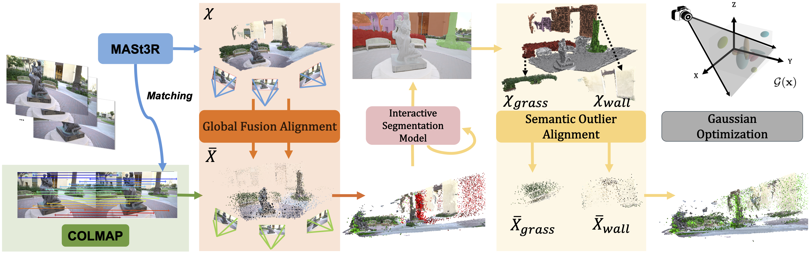

  <h1 align="center">
  SPARS3R: Semantic Prior Alignment and Regularization for Sparse 3D Reconstruction
   
  
  </h1>
  

    <a href="https://github.com/snldmt/">Yutao Tang*</a>
    ,
    <a href="https://aiem.jhu.edu/lab-members/">Yuxiang Guo*</a>
    ,
    <a href="https://aiem.jhu.edu/lab-members/">Deming Li</a>
    ,
    <a href="https://sites.google.com/view/cheng-peng/home"> Cheng Peng </a>
     (*Equal contribution) 

  

  <h3 align="center"> <a href="https://arxiv.org/pdf/2411.12592">arXiv</a> | <a href="https://arxiv.org/pdf/2411.12592">Project Page</a> </h3>
  

Code to be released soon.

## Method Overview

Recent efforts in Gaussian-Splat-based Novel View Synthesis can achieve photorealistic rendering; however, such capability is limited in sparse-view scenarios due to sparse
initialization and over-fitting floaters. Recent progress in
depth estimation and alignment can provide dense point
cloud with few views; however, the resulting pose accuracy
is suboptimal. In this work, we present SPARS3R, which
combines the advantages of accurate pose estimation from
Structure-from-Motion and dense point cloud from depth
estimation. To this end, SPARS3R first performs a Global
Fusion Alignment process that maps a prior dense point
cloud to a sparse point cloud from Structure-from-Motion
based on triangulated correspondences. RANSAC is applied during this process to distinguish inliers and outliers.
SPARS3R then performs a second, Semantic Outlier Alignment step, which extracts semantically coherent regions
around the outliers and performs local alignment in these
regions. Along with several improvements in the evaluation
process, we demonstrate that SPARS3R can achieve photorealistic rendering with sparse images and significantly
outperforms existing approaches

